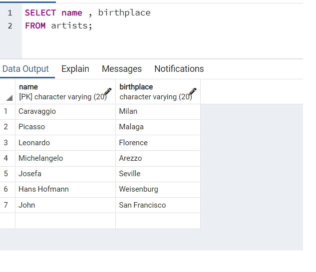
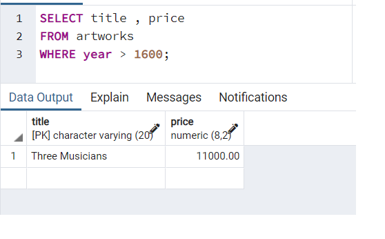
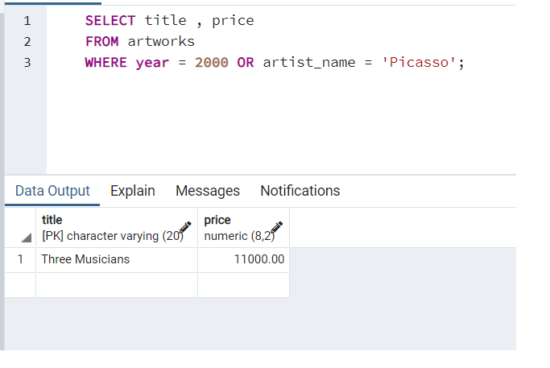
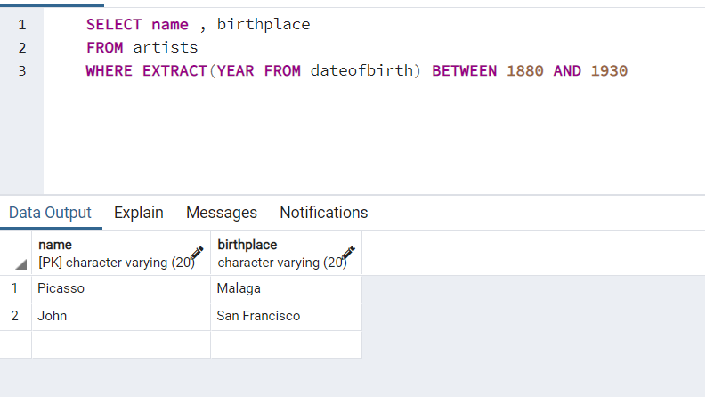
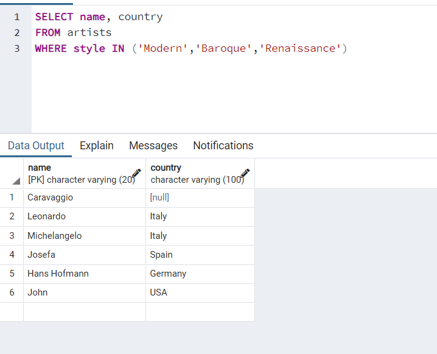
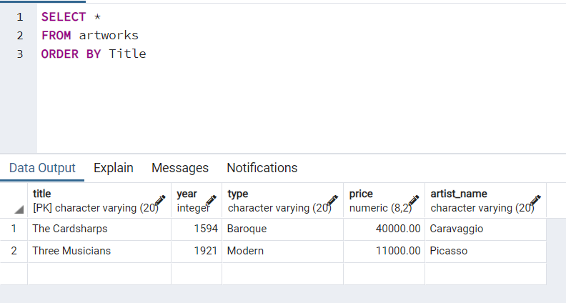
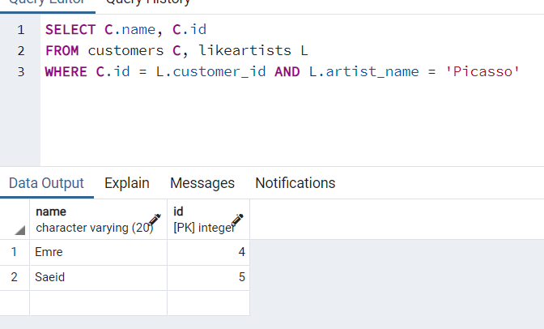
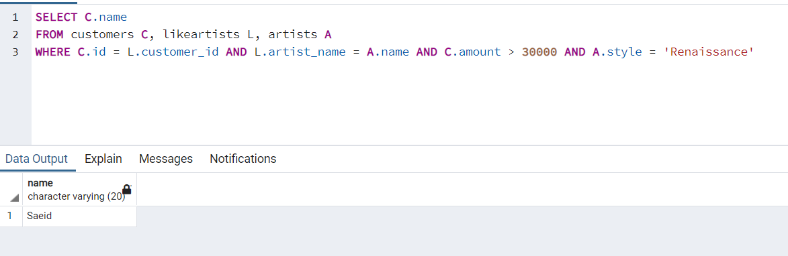

### Giorgio Sawaya - 300126961

## Solution au liste d'exercise pour le lab 6 

#### 1. Lister les name et birthplace de tous les artists

SELECT name , birthplace
FROM artists;

#### 2. Lister le title et le price de toutes les artworks après 1600.

SELECT title , price
FROM artworks
WHERE year > 1600;

#### 3. Lister le title et le type de toutes les artworks qui ont été peintes en 2000 ou peintes par Picasso.

SELECT title , price
FROM artworks
WHERE year = 2000 OR artists = 'Picasso';

#### 4.  Lister les name et birthplace de tous les artists nés entre 1880 et 1930. (ASTUCE: EXTRACT(YEAR FROM dateofbirth) vous donne l'année à partir d'un attribut DATE)

SELECT name , birthplace
FROM artists
WHERE EXTRACT(YEAR FROM dateofbirth) BETWEEN 1880 AND 1930

#### 5. Lister les name et le country de naissance de tous les artists dont le style de peinture est Modern, Baroque or Renaissance. (ASTUCE: utilisez le mot-clé IN).

SELECT *
FROM artists
WHERE style IN ('Modern','Baroque','Renaissance')

#### 6. Lister tous les détails des artworks dans la base de données, triés par title.

SELECT *
FROM artworks
ORDER BY Title

#### 7. Lister les name et les customer ids de tous les customers qui aiment Picasso.

SELECT C.name, C.id 
FROM customers C, likeartists L
WHERE C.id = L.customer_id AND L.artist_name = 'Picasso'

#### 8.Lister les name de tous lescustomers qui aiment les artistes de style Renaissance et dont le price est supérieur à 30000.

SELECT C.name 
FROM customers C, likeartists L, artists A
WHERE C.id = L.customer_id AND L.artist_name = A.name AND C.amount > 30000 AND A.style = 'Renaissance'

